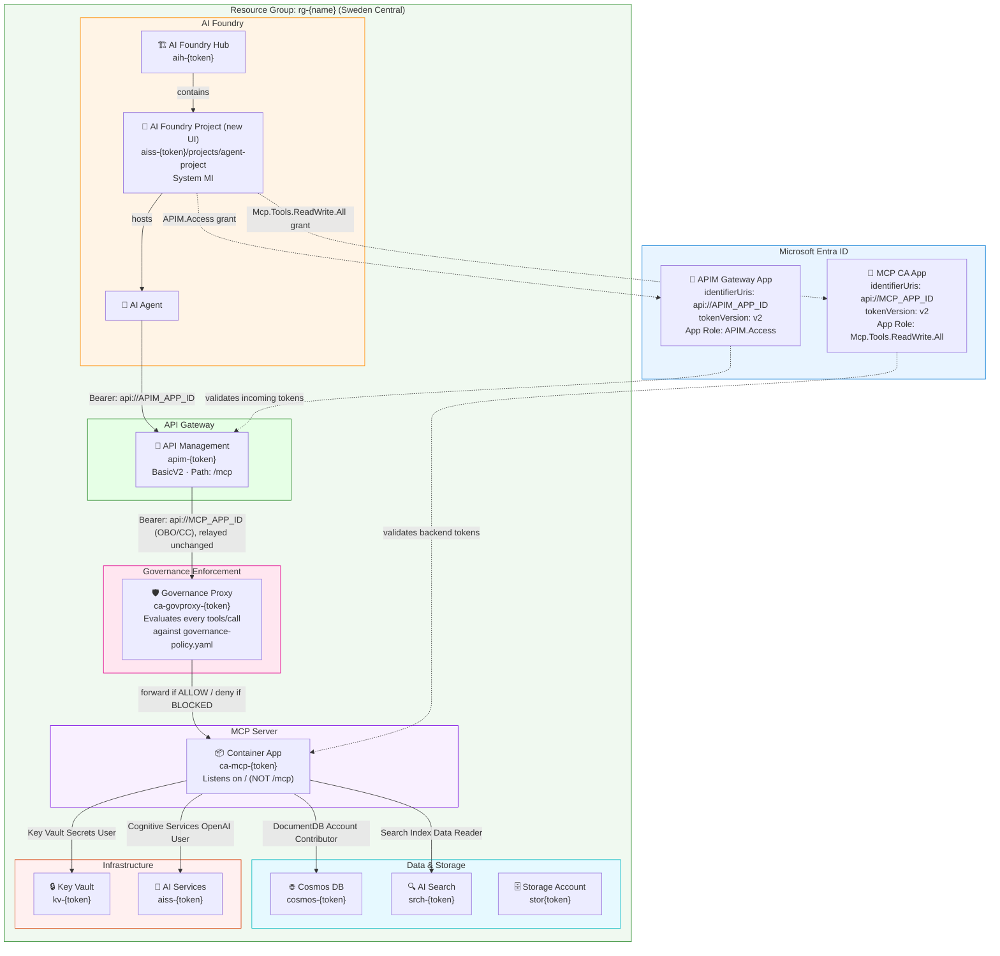
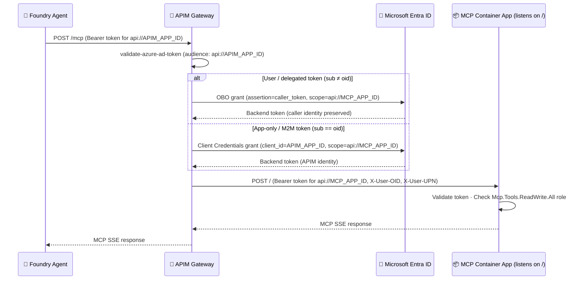

# Azure AI Agent POC — APIM-Gated MCP Server

An Azure AI Agent proof-of-concept that connects an **AI Foundry Agent** to a remote **MCP (Model Context Protocol) server** through a secure **API Management gateway**. APIM validates Entra ID tokens and performs OBO/CC token exchange before forwarding to the MCP Container App.

<p align="center">
  <strong>
    🚀 <a href="#quick-start">Quick Start</a> ·
    🏗 <a href="#architecture-overview">Architecture</a> ·
    🔧 <a href="#troubleshooting">Troubleshooting</a> ·
    📋 <a href="#key-ids-reference">Key IDs Reference</a>
  </strong>
</p>

---

## Quick Start

> [!NOTE]
> **APIM BasicV2 takes ~20 minutes to provision.** The first `deploy.sh` run will partially fail while APIM child resources (APIs, policies) time out. This is expected — run it a second time once APIM is ready and everything succeeds idempotently.

### Prerequisites

| Tool | Install |
|---|---|
| Azure CLI | `az login` (must be logged in) |
| `jq` | `sudo apt install jq` / `brew install jq` |
| `python3` | Python 3.8+ |
| Permissions | **Contributor** on the target subscription + **Application Administrator** in Entra ID |

### Step 1 — Configure your environment

```bash
# Clone the repo and copy the environment template
cp .env.example .env
```

Open `.env` and fill in these two required fields before anything else:

```bash
AZURE_TENANT_ID=<your-tenant-id>
AZURE_SUBSCRIPTION_ID=<your-subscription-id>
```

### Step 2 — First deploy (pass 1 of 2)

> [!IMPORTANT]
> **`MCP_APP_ID` is a chicken-and-egg problem on first deploy.** The MCP Container App's Entra app is created automatically by Azure Container Apps Easy Auth — it doesn't exist until after the first Bicep deployment. For the first run, leave `MCP_APP_ID` blank in `.env`. The script will deploy with a placeholder and continue.

```bash
./deploy.sh
```

You will be prompted for:
- **Deployment name** — a short label (e.g. `my-agent-poc`)
- **Resource group name** — e.g. `rg-agentpoc`
- **Azure region** — e.g. `swedencentral`
- **Publisher email** — used for APIM notifications

`deploy.sh` will automatically create the **APIM Gateway Entra app** and save its ID back to `.env`.

> [!WARNING]
> The first run will print errors like `"Policy size exceeds allowed limit of -1 KB"` and APIM child resource failures. **This is expected.** APIM BasicV2 takes ~20 minutes to fully provision. Wait until `az rest` confirms `"provisioningState": "Succeeded"` before proceeding:
> ```bash
> az rest --method GET \
>   --uri "https://management.azure.com/subscriptions/$AZURE_SUBSCRIPTION_ID/resourceGroups/$RESOURCE_GROUP_NAME/providers/Microsoft.ApiManagement/service/apim-<token>?api-version=2023-05-01-preview" \
>   --query "properties.provisioningState"
> ```

### Step 3 — Second deploy (pass 2 of 2)

Once APIM shows `"Succeeded"`, re-run the deployment. Everything is idempotent and all APIM child resources will now succeed:

```bash
./deploy.sh --ci
```

> [!TIP]
> If `APIM_STANDARD_NAME` is missing from `.env` after this run (can happen when APIM output wasn't captured in pass 1), retrieve the name manually:
> ```bash
> APIM_NAME=$(az apim list -g "$RESOURCE_GROUP_NAME" --query "[0].name" -o tsv)
> echo "APIM_STANDARD_NAME=$APIM_NAME" >> .env
> ```

### Step 4 — Collect MCP app IDs

Container Apps Easy Auth creates the MCP CA Entra app automatically during the Bicep deployment. Retrieve its IDs and save them to `.env`:

```bash
RG=<your-resource-group-name>   # e.g. rg-agentpoc

MCP_CA_NAME=$(az containerapp list -g "$RG" --query "[?contains(name,'ca-mcp')].name" -o tsv)
MCP_APP_ID=$(az ad app list --display-name "$MCP_CA_NAME" --query '[0].appId' -o tsv)
MCP_APP_SP_OID=$(az ad sp show --id "$MCP_APP_ID" --query id -o tsv)
MCP_APP_ROLE_ID=$(az ad app show --id "$MCP_APP_ID" \
  --query "appRoles[?value=='Mcp.Tools.ReadWrite.All'].id" -o tsv)

echo "MCP_APP_ID=$MCP_APP_ID" >> .env
echo "MCP_APP_SP_OBJECT_ID=$MCP_APP_SP_OID" >> .env
echo "MCP_APP_ROLE_ID=$MCP_APP_ROLE_ID" >> .env
```

### Step 5 — Configure auth and apply the APIM policy

```bash
./setup-obo-auth.sh
```

This script handles all Entra and APIM wiring in one go:

- Sets `identifierUris` and `requestedAccessTokenVersion=2` on both Entra apps
- Creates the `APIM.Access` app role on the APIM Gateway app
- Grants `APIM.Access` and `Mcp.Tools.ReadWrite.All` to the Foundry Project MI
- Grants `Mcp.Tools.ReadWrite.All` to the APIM Gateway App SP
- Applies the APIM policy using `rawxml` format and correct API version (`2024-05-01`)

> [!WARNING]
> **APIM Gateway SP replication delay.** If `deploy.sh` printed `⚠️ SP not found yet` during step 2, the service principal may not have been saved to `.env` correctly. Check `APIM_GATEWAY_SP_OBJECT_ID` in your `.env` — if it contains `<run: az ad sp create ...>` instead of a GUID, fix it manually:
> ```bash
> APIM_GATEWAY_SP_OBJECT_ID=$(az ad sp show --id "$APIM_GATEWAY_APP_ID" --query id -o tsv 2>/dev/null \
>   || az ad sp create --id "$APIM_GATEWAY_APP_ID" --query id -o tsv)
> # Update .env with the correct value, then re-run setup-obo-auth.sh
> ```

### Step 6 — Configure the AI Foundry agent

1. Open [AI Foundry Portal](https://ai.azure.com) → your project (`agent-project`) → **Agents**
2. Add an **MCP tool** with these settings:

   | Field | Value |
   |---|---|
   | Server URL | `https://apim-{token}.azure-api.net/mcp` |
   | Authentication | Microsoft Entra ID |
   | Audience / Scope | `api://<apim-gateway-app-id>/.default` |

   > Find the APIM URL in `.env` as `APIM_GATEWAY_URL` and the App ID as `APIM_GATEWAY_APP_ID`.

### Step 7 — Verify end-to-end

```bash
# Read values from .env
source .env

# Get a client credentials token for the APIM gateway app
TOKEN=$(curl -s -X POST "https://login.microsoftonline.com/$AZURE_TENANT_ID/oauth2/v2.0/token" \
  -d "grant_type=client_credentials\
&client_id=$APIM_GATEWAY_APP_ID\
&client_secret=$APIM_GATEWAY_CLIENT_SECRET\
&scope=api://$APIM_GATEWAY_APP_ID/.default" \
  | jq -r .access_token)

# Send an MCP initialize request — expect HTTP 200 with "Azure MCP Server" in the response
curl -s -X POST "$APIM_GATEWAY_URL/mcp" \
  -H "Authorization: Bearer $TOKEN" \
  -H "Content-Type: application/json" \
  -d '{"jsonrpc":"2.0","id":1,"method":"initialize","params":{"protocolVersion":"2024-11-05","capabilities":{},"clientInfo":{"name":"test","version":"1.0"}}}'
```

Expected response: HTTP 200 with an SSE event containing `"Azure MCP Server"`. 🎉

---

## Architecture Overview



> Resource suffix `{token}` = `take(uniqueString(subscriptionId, resourceGroupName, location), 8)` — deterministic per subscription + RG name + region. Use a unique RG name to get unique resource names.

---

## APIM as MCP Gateway

APIM is the **sole entry point** for the MCP server. No caller reaches the Container App directly. The policy in `infra/apim-obo-policy.xml` implements the following flow:



### Token type detection

The policy uses `sub != oid` — in Entra v2 tokens:
- **App-only tokens**: `sub == oid` (both equal the SP's Object ID) → Client Credentials grant
- **User/delegated tokens**: `sub` is a pairwise-pseudonymous value ≠ `oid` → OBO grant

This is more reliable than `idtyp` which some issuers (IMDS, Foundry MI) omit.

---

## Deployed Resources

| Resource | Name Pattern | Purpose |
|---|---|---|
| AI Services (CognitiveServices) | `aiss-{token}` | Hosts the GPT model deployment |
| AI Foundry Hub | `aih-{token}` | ML workspace hub; links Key Vault, Storage, App Insights |
| AI Foundry Project (old UI) | `aip-{token}` | ML workspace project (backward compat) |
| AI Foundry Project (new UI) | `aiss-{token}/projects/agent-project` | CognitiveServices project — visible in ai.azure.com |
| API Management | `apim-{token}` | MCP gateway: validates tokens, performs OBO/CC exchange |
| Container App | `ca-mcp-{token}` | Runs Azure MCP server (`azure-sdk/azure-mcp:latest`) |
| Container Apps Env | `cae-{token}` | Managed environment |
| Cosmos DB | `cosmos-{token}` | Database backend for agent state |
| AI Search | `srch-{token}` | Semantic search / RAG index |
| Key Vault | `kv-{token}` | Secrets and credentials |
| Container Registry | `cr{token}` | Optional: private registry for custom MCP images |
| Log Analytics | `log-{token}` | Container App log sink |
| App Insights | `appi-{token}` | Application telemetry |
| Storage Account | `stor{token}` | Blob storage for AI Foundry Hub artifacts |

---

## RBAC Role Assignments

### Container App Managed Identity → Azure Resources

| Target | Role | Purpose |
|---|---|---|
| Subscription | **Reader** | Enumerate resource groups and Azure resources |
| Key Vault | **Key Vault Secrets User** | Read secrets |
| Cosmos DB | **DocumentDB Account Contributor** | Read/write documents |
| AI Search | **Search Index Data Reader** | Query search indexes |
| AI Services | **Cognitive Services OpenAI User** | Call OpenAI endpoints |
| AI Services | **Cognitive Services User** | Access AI Services account |

### AI Foundry Hub Managed Identity → Azure Resources

| Target | Role | Purpose |
|---|---|---|
| Storage Account | **Storage Blob Data Contributor** | Read/write workspace artifacts |
| Key Vault | **Key Vault Secrets User** | Read workspace secrets |
| AI Services | **Cognitive Services User** | Access AI Services through the Hub |

### AI Foundry Project Managed Identity → Azure Resources

| Target | Role | Purpose |
|---|---|---|
| Storage Account | **Storage Blob Data Contributor** | Read/write project artifacts |
| AI Services | **Cognitive Services OpenAI User** | Invoke model deployments |

### Entra App Role Grants (configured by `setup-obo-auth.sh`)

| Principal | App Role | On App | Purpose |
|---|---|---|---|
| Foundry Project MI | `APIM.Access` | APIM Gateway App | Get a CC token to call APIM (required for agent→APIM) |
| Foundry Project MI | `Mcp.Tools.ReadWrite.All` | MCP CA App | OBO backend token carries correct role |
| APIM Gateway App SP | `Mcp.Tools.ReadWrite.All` | MCP CA App | CC flow: APIM calls MCP as its own identity |

---

## Entra ID App Registrations

> [!WARNING]
> **Both app registrations require specific settings that are NOT defaults.** Without these, Entra will reject token requests with `400 invalid_resource` or `invalid_audience` errors.

### MCP CA App

Created automatically by Container Apps Easy Auth on the first Bicep deployment. `setup-obo-auth.sh` configures it.

| Setting | Required Value | Why |
|---|---|---|
| `identifierUris` | `["api://<mcp-app-id>"]` | Entra rejects `api://<appId>` as audience if no matching URI is registered |
| `requestedAccessTokenVersion` | `2` | v2 tokens contain `oid`, `sub`, and `roles` claims required by the APIM policy |
| App Role: `Mcp.Tools.ReadWrite.All` | Exists by default (created by Easy Auth) | Required in the `roles` claim of backend tokens |

### APIM Gateway App

Created by `deploy.sh` before the first Bicep deployment. `setup-obo-auth.sh` configures it.

| Setting | Required Value | Why |
|---|---|---|
| `identifierUris` | `["api://<apim-gateway-app-id>"]` | Callers request `api://<appId>/.default` scope — this must be registered |
| `requestedAccessTokenVersion` | `2` | Ensures v2 tokens so the APIM `validate-azure-ad-token` policy works correctly |
| Delegated scope: `user_impersonation` | Present | Required for OBO flow |
| App Role: `APIM.Access` | Created by `setup-obo-auth.sh` | Foundry Project MI needs this role to get a CC token for APIM |
| Named values in APIM | `obo-client-id`, `obo-client-secret` | Used by APIM policy for token exchange |

---

## AI Foundry Project (new UI)

The new [AI Foundry UI](https://ai.azure.com) shows `Microsoft.CognitiveServices/accounts/projects` resources, not the older `MachineLearningServices/workspaces` kind=Project.

This project deploys both:
- **Old-style project** (`aip-{token}`) — backward compatibility, linked to the Hub for monitoring
- **New-style project** (`agent-project` under `aiss-{token}`) — visible in the new AI Foundry UI

Access the new project at: `https://aiss-{token}.services.ai.azure.com/api/projects/agent-project`

---

## Testing

### Agent test script

```bash
python3 test_agent_mcp.py --phase 1   # CLI → APIM → MCP
python3 test_agent_mcp.py --phase 2   # Create Foundry agent with MCP tool
python3 test_agent_mcp.py --phase 3   # Run agent conversation
```

---

## Governance Demo

This repo includes a lightweight demo of Microsoft's open-source
[Agent Governance Toolkit](https://github.com/microsoft/agent-governance-toolkit),
showing policy-based allow/deny enforcement in front of the MCP tool calls
above (`policies/governance-policy.yaml`, `demo_governance.py`, and
`test_agent_mcp.py --governed`). See
[`docs/governance-demo.md`](docs/governance-demo.md) for the full walkthrough.

### Centralized enforcement: the Governance Proxy

The standalone demo above only enforces policy for code paths that explicitly
call `agentmesh.governance.govern()` — i.e. `demo_governance.py` and
`test_agent_mcp.py --governed`. Any *other* caller (the Foundry Playground's
native Tools catalog, a different script, a teammate's own client) would
bypass it entirely, since nothing forces every caller through governed code.

To close that gap, this repo also deploys a **governance proxy** — a small
FastAPI service (`governance-proxy/app.py`) sitting between APIM and the real
MCP Container App:

```
Foundry / any caller ──▶ APIM (auth + OBO/CC token exchange) ──▶ Governance Proxy ──▶ MCP Container App
```

APIM already validates the caller's token and exchanges it for a token scoped
to the MCP CA app (`infra/apim-obo-policy.xml`) — the proxy trusts that and
does **not** re-authenticate. Instead, for every `tools/call` JSON-RPC
request it:

1. Extracts the tool name + arguments and evaluates them against
   `policies/governance-policy.yaml` (the exact same policy file the demo
   scripts use — single source of truth).
2. **Allowed** → relays the request unchanged (same headers, same backend
   Authorization token) to the real MCP Container App.
3. **Denied** → returns a JSON-RPC error immediately; the real MCP server is
   never touched.

Because APIM's backend now points at this proxy instead of the MCP Container
App directly (`infra/modules/apim.bicep` → `mcpBackendUrl`), **every**
documented calling path (Foundry Playground, `test_agent_mcp.py`, or any
future client) is governed — not just calls that import `agentmesh.governance`
themselves.

`deploy.sh` builds and pushes the proxy's image to the deployment's ACR via
`az acr build`, then swaps it into the already-deployed Container App with
`az containerapp update` (the Bicep module deploys with a small placeholder
image first, since the ACR doesn't exist until that same deployment creates
it). Registry authentication for the private ACR is configured declaratively
in `infra/modules/governance-proxy.bicep` (a `registries` block using the
Container App's own system-assigned identity) — no manual
`az containerapp registry set` step required. To roll back to transparent
pass-through without redeploying, set `GOVERNANCE_ENABLED=false` on the
`ca-govproxy-{token}` Container App.

**Disabling the proxy entirely**: set `ENABLE_GOVERNANCE_PROXY=false` in
`.env` before running `deploy.sh` (or pass `enableGovernanceProxy=false` to
`az deployment sub create`). When disabled, `main.bicep` skips the proxy
module altogether, APIM's backend points directly at the MCP Container App,
and `deploy.sh` skips the image build/swap step — useful for environments
that don't need centralized enforcement or want to avoid the extra hop/cost.
Defaults to `true` (enabled).

> [!NOTE]
> **Known residual gap**: a caller with a valid Entra token for the MCP CA
> app who calls the MCP Container App's own FQDN directly (bypassing APIM
> and the proxy) still isn't governed. Closing that fully requires network
> isolation — locking the MCP Container App to internal-only ingress with
> APIM VNet-integrated to reach it — a larger change not yet implemented here.

---

## Troubleshooting

### HTTP 500 "Internal server error" from APIM

Enable APIM tracing to see which policy expression is failing:

```bash
# 1. Get a trace credential
az rest --method POST \
  --uri "https://management.azure.com/subscriptions/<sub>/resourceGroups/<rg>/providers/Microsoft.ApiManagement/service/<apim>/gateways/managed/listDebugCredentials?api-version=2023-05-01-preview" \
  --body '{"credentialsExpireAfter":"PT1H","apiId":"/subscriptions/<sub>/resourceGroups/<rg>/providers/Microsoft.ApiManagement/service/<apim>/apis/mcp-gateway","purposes":["tracing"]}' \
  --query token -o tsv

# 2. Add "Apim-Debug-Authorization: <token>" header to your test request
# 3. Retrieve the trace using the Apim-Trace-Id response header
```

Common root causes:
- `NullReferenceException` on `context.Request.Url.Path` — fixed by `?? string.Empty` null-safe check in policy
- `Body.As<JObject>()` returning null — fixed by `preserveContent:true` + `JObject.Parse()` from variable
- Missing `identifierUris` → token exchange fails → 500 (not 502) — fixed by `setup-obo-auth.sh`

### HTTP 502 `token_exchange_failed`

APIM received the caller token but could not exchange it. Check:
1. `obo-client-id` and `obo-client-secret` named values are set in APIM
2. APIM Gateway App SP has `Mcp.Tools.ReadWrite.All` on the MCP CA app SP
3. Both Entra apps have `identifierUris` configured
4. Re-run `./setup-obo-auth.sh` to sync everything

### HTTP 400 `ARA request failed with status BadRequest` (from Foundry)

Foundry's agent runtime could not get an access token for the APIM gateway resource.

Check:
1. The APIM Gateway app has `identifierUris: ["api://<appId>"]` configured
2. The Foundry Project MI has `APIM.Access` granted on the APIM Gateway app SP
3. Run `./setup-obo-auth.sh` to apply all required Entra settings

### HTTP 401 from APIM

The caller token is missing or invalid. Check:
1. Token audience matches `api://<apim-gateway-app-id>` or `<apim-gateway-app-id>`
2. The token is from the correct Entra tenant
3. The WWW-Authenticate response header gives the correct `resource_metadata` URL

### HTTP 403 from MCP Container App

The backend token is valid but lacks the `Mcp.Tools.ReadWrite.All` role in the `roles` claim. Check:
1. For CC tokens: APIM Gateway App SP must have the role granted on the MCP CA app SP
2. For OBO tokens: the calling user must have the role granted
3. Wait 5 minutes for Entra role cache to refresh after granting

### Project not visible in new AI Foundry UI

Only `Microsoft.CognitiveServices/accounts/projects` resources appear in the new UI. The old `MachineLearningServices/workspaces` kind=Project does not.

Both types are deployed by this Bicep. If you only see the old project, look for `agent-project` under the `aiss-{token}` AI Services account.

### `tool_server_error` / HTTP 424 "Error retrieving tool list from MCP server" on agent run

**Symptom**: `test_agent_mcp.py --governed` Phase 3 reaches `RunStatus.REQUIRES_ACTION` for the MCP tool, you approve it, then the run fails with `tool_server_error` / HTTP 424 (Failed Dependency), even though Phase 1's direct APIM call and the Container App's own logs show `tools/list` returning 200.

**Root cause (seen in this repo)**: the run-level `tool_resources.mcp[].headers.Authorization` value (and/or the `ToolApproval.headers.Authorization` value used during approval) was not actually interpolating the bearer token — e.g. a stray string like `"Bearer ******"` instead of `f"Bearer {token}"`. Foundry's own MCP client then can't authenticate its second tool-list/tool-call round-trip through APIM, even though your Phase 1 test (a different, valid token) succeeded.

**Fix**: Double-check that every `Authorization` header built for the run (`mcp_tool_resources` at agent-run creation and `ToolApproval(headers=...)` at approval time) contains the real token string, not a placeholder — print/log the header length or a token prefix while debugging, since accidentally hard-coding a literal string is easy to miss.

---

## Known Issues & Lessons Learned

These are bugs discovered during real end-to-end deployments. All fixes are already in the current codebase.

### 1. `context.Request.Url.Path` is null at the API root

**Symptom**: APIM returns HTTP 500 on all requests; trace shows `Object reference not set to an instance of an object`.

**Root cause**: When a request hits `/mcp` exactly (no trailing path), APIM strips the API prefix and the remaining path is `null`. `null.Contains(...)` throws.

**Fix** (already in `apim-obo-policy.xml`):
```xml
<when condition="@((context.Request.Url.Path ?? string.Empty).Contains("well-known/..."))">
```

### 2. `Body.As<JObject>()` body stream consumed before the error check

**Symptom**: APIM returns HTTP 500 after successful token exchange; `Authorization` header is never set.

**Root cause**: `Body.As<JObject>()` reads the stream once — if the `StatusCode != 200` check reads it first, the second read returns null.

**Fix** (already in `apim-obo-policy.xml`):
```xml
<!-- Capture body once with preserveContent:true -->
<set-variable name="backend-token-body"
  value="@(((IResponse)context.Variables["backend-token-response"]).Body.As<string>(preserveContent: true))" />
<!-- Then parse from the variable, not from Body again -->
<set-header name="Authorization" exists-action="override">
  <value>@("Bearer " + (string)Newtonsoft.Json.Linq.JObject.Parse(
    (string)context.Variables["backend-token-body"])["access_token"])</value>
</set-header>
```

### 3. Missing `identifierUris` on Entra app registrations

**Symptom**: Foundry agent gets HTTP 400 `ARA request failed with status BadRequest`. APIM token exchange fails with `invalid_resource`.

**Root cause**: `az ad app create` does not add `identifierUris` by default. Entra rejects any token request referencing `api://<appId>` if no matching URI is registered.

**Fix**: `setup-obo-auth.sh` sets `identifierUris: ["api://<appId>"]` and `requestedAccessTokenVersion: 2` on both apps.

### 4. APIM policy `format: xml` vs `rawxml`

**Symptom**: Policy applies without error, but APIM C# expressions with `&` fail at runtime.

**Root cause**: The policy uses `&amp;` in C# form body strings. With `format: xml`, APIM double-decodes `&amp;`. With `format: rawxml`, it decodes exactly once at compile time.

**Fix**: `setup-obo-auth.sh` uses `format: rawxml` with API version `2024-05-01`.

### 5. MCP Container App path mismatch

**Symptom**: APIM forwards requests to the backend but receives HTTP 404.

**Root cause**: The MCP server listens on `/`, not `/mcp`. APIM was forwarding `/mcp/...` → backend `/mcp/...` → 404.

**Fix** (already in `apim-obo-policy.xml`):
```xml
<rewrite-uri template="/" copy-unmatched-params="true" />
```

### 6. New AI Foundry UI uses a different resource type

**Symptom**: Project created by Bicep is not visible in the new [ai.azure.com](https://ai.azure.com) portal.

**Root cause**: The new AI Foundry UI only shows `Microsoft.CognitiveServices/accounts/projects`.

**Fix** (already in `infra/modules/ai-services.bicep`): Added the `agent-project` resource with `allowProjectManagement: true` and API version `2025-04-01-preview`.

### 7. APIM `gatewayUrl` already includes `https://`

**Symptom**: Deployment output shows `apimGatewayUrl: https://https://apim-xyz.azure-api.net`.

**Root cause**: `apim.properties.gatewayUrl` already returns the full URL; adding a prefix doubles it.

**Fix** (already in `infra/modules/apim.bicep`):
```bicep
output apimGatewayUrl string = apim.properties.gatewayUrl
```

### 8. `.env` placeholder text isn't caught by `deploy.sh`'s `:?` checks

**Symptom**: `deploy.sh --ci` succeeds, but the deployed Container App has `AzureAd__ClientId` literally set to the string `<mcp-ca-app-registration-client-id>` instead of a real GUID. Token validation then fails silently at the backend.

**Root cause**: `deploy.sh` and `setup-obo-auth.sh` guard required variables with `: "${VAR:?message}"`, which only catches **unset or empty** variables — not variables that still contain literal placeholder text copied from `.env.example`. If `deploy.sh --ci` is run once before `MCP_APP_ID` (or `APIM_GATEWAY_APP_ID`) is populated, the placeholder gets baked into the Container App's env vars on the first pass and is never corrected on subsequent passes unless you re-run with `--set-env-vars` manually.

**Fix**: Before running `./deploy.sh`, grep `.env` for any remaining `<...>` placeholder syntax:
```bash
grep -E '<[a-z-]+>' .env && echo "⚠️  Placeholder values still present in .env — fill these in first"
```
This check is not yet automated in `deploy.sh` itself — worth adding as a pre-flight step for anyone extending this repo.

### 9. OBO (delegated) MCP calls need a permission **grant**, not just an app role assignment

**Symptom**: APIM returns HTTP 502 — `APIM could not obtain a backend token for the MCP server` — even though `setup-obo-auth.sh` ran successfully and the APIM Gateway App SP already has `Mcp.Tools.ReadWrite.All` assigned on the MCP CA app.

**Root cause**: The `jwt-bearer` (on-behalf-of) grant used by `apim-obo-policy.xml` requires the **client** (APIM Gateway app) to hold a **delegated permission grant** (`oauth2PermissionGrant` on the MCP CA app's `user_impersonation` scope, with admin consent) — this is separate from, and in addition to, any application **role assignment** the client SP has. `setup-obo-auth.sh` only configures the role assignment (which is sufficient for pure client-credentials/app-only calls), never the delegated grant, so the OBO/delegated-user path is non-functional out of the box.

**Fix** (manual, not yet scripted):
```bash
# Add delegated permission + consent from APIM Gateway app to MCP CA app
az ad app permission add --id <apim-gateway-app-id> \
  --api <mcp-ca-app-id> --api-permissions <user_impersonation-scope-id>=Scope
az ad app permission grant --id <apim-gateway-app-id> --api <mcp-ca-app-id> \
  --scope user_impersonation
az ad app permission admin-consent --id <apim-gateway-app-id>
```
Worth adding to `setup-obo-auth.sh` for future users — not yet patched into the script.

### 10. OBO tokens carry the **signed-in user's** roles, not the client app's

**Symptom**: After fixing #9, the 502 becomes a **403 Forbidden** at the MCP Container App.

**Root cause**: Once the OBO exchange succeeds, the resulting token's `roles` claim reflects **the calling user's** app-role assignments on the resource — not the APIM Gateway app's own assignment (which only applies to app-only/client-credentials tokens). The signed-in user must separately hold `Mcp.Tools.ReadWrite.All` on the MCP CA app's service principal.

**Fix**: Assign the role directly to the user via Graph:
```bash
az rest --method POST \
  --uri "https://graph.microsoft.com/v1.0/servicePrincipals/<mcp-ca-sp-object-id>/appRoleAssignedTo" \
  --body '{"principalId":"<user-object-id>","resourceId":"<mcp-ca-sp-object-id>","appRoleId":"<Mcp.Tools.ReadWrite.All-role-id>"}'
```

### 11. Foundry Assistants API returns MCP tool-call results via `submit_tool_approval`, not `submit_tool_outputs`

**Symptom**: `test_agent_mcp.py` crashes with `AttributeError: 'RunRequiredAction' object has no attribute 'submit_tool_outputs'` (or similar) once the agent reaches `RunStatus.REQUIRES_ACTION` for an MCP tool.

**Root cause**: `azure-ai-agents` uses different `RunRequiredAction` subtypes depending on tool type — function/code-interpreter tools use `SubmitToolOutputsAction` (`.submit_tool_outputs.tool_calls`), but **MCP tools use `SubmitToolApprovalAction`** (`.submit_tool_approval.tool_calls`, a list of `RequiredMcpToolCall` with `id`/`name`/`arguments`/`server_label` — no `.function` nesting). Submission still goes through `agents_client.runs.submit_tool_outputs(...)`, but with a `tool_approvals=[ToolApproval(tool_call_id=..., approve=True, headers={...})]` kwarg instead of `tool_outputs=[...]`.

**Fix** (already applied in `test_agent_mcp.py`): read `run.required_action.submit_tool_approval.tool_calls`, build `ToolApproval` objects (with the APIM bearer token forwarded in `headers={"Authorization": f"Bearer {token}"}`), and pass them as `tool_approvals=` to `runs.submit_tool_outputs(...)`.

### 12. Foundry portal "Project Managed Identity" tool auth fails with 401, even though the Foundry project's own role assignment is correct

**Symptom**: A Tools-catalog MCP connection using Authentication = Microsoft Entra / Project Managed Identity works in Entra terms (project SP has `APIM.Access` on the APIM Gateway app, token audience/tenant/version all correct -- confirmed via a temporary APIM debug policy that echoed back the incoming token's claims), yet the Playground still fails with `401 Unauthorized` or `MCP Protocol Exception ... Request failed (remote)`.

**Root cause**: The Foundry project's managed identity calls APIM with an **app-only** token (`sub == oid`). Per `apim-obo-policy.xml`'s branch logic, app-only tokens go through the **client-credentials** path -- APIM exchanges a token using **its own Gateway App identity** (`obo-client-id`/`obo-client-secret`), not the caller's. This means the Gateway App's own service principal -- not the Foundry project's SP -- must hold `Mcp.Tools.ReadWrite.All` on the MCP Container App. Having the *project's* SP correctly role-assigned is necessary but not sufficient; it's irrelevant to this code path.

Separately, `.env`'s `APIM_GATEWAY_SP_OBJECT_ID` must stay in sync with the actual current Gateway App SP -- if it's ever left pointing at a stale/prior deployment's SP (e.g. after redeploying APIM or renaming resources), `setup-obo-auth.sh`'s Step 1 will silently assign the role to the wrong (old) service principal instead of the current one.

**Fix**:
1. Confirm/update `.env`'s `APIM_GATEWAY_APP_ID` and `APIM_GATEWAY_SP_OBJECT_ID` match the *currently deployed* APIM Gateway app (`az ad sp show --id <APIM_GATEWAY_APP_ID> --query id -o tsv`).
2. Re-run `./setup-obo-auth.sh` -- it's idempotent and its Step 1 will assign `Mcp.Tools.ReadWrite.All` to the Gateway App SP on the MCP CA if missing.
3. Verify directly: `az rest --method get --url "https://graph.microsoft.com/v1.0/servicePrincipals/<mcp-ca-sp-object-id>/appRoleAssignedTo"` should list the current Gateway App SP's `principalDisplayName`.
4. Also watch for stray whitespace in `.env` values (e.g. `AGENT_NAME= foo` with a leading space) -- some scripts load `.env` via `xargs`/`export`, which breaks on values containing unquoted leading spaces, causing `export: 'foo': not a valid identifier` and silently aborting the rest of the script.

---

## Key IDs Reference

After deploying, these values are populated in `.env` by `deploy.sh`:

| Item | `.env` Variable |
|---|---|
| Tenant ID | `AZURE_TENANT_ID` |
| Subscription ID | `AZURE_SUBSCRIPTION_ID` |
| Resource Group | `RESOURCE_GROUP_NAME` |
| APIM instance name | `APIM_STANDARD_NAME` |
| APIM gateway URL | `APIM_GATEWAY_URL` |
| APIM Gateway App ID | `APIM_GATEWAY_APP_ID` |
| APIM Gateway App SP OID | `APIM_GATEWAY_SP_OBJECT_ID` |
| MCP CA App ID | `MCP_APP_ID` |
| MCP CA App SP OID | `MCP_APP_SP_OBJECT_ID` |
| `Mcp.Tools.ReadWrite.All` Role ID | `MCP_APP_ROLE_ID` |
| New Foundry Project MI OID | `FOUNDRY_PROJECT_MI_OBJECT_ID` |
| New Foundry Project endpoint | `NEW_FOUNDRY_PROJECT_ENDPOINT` |
